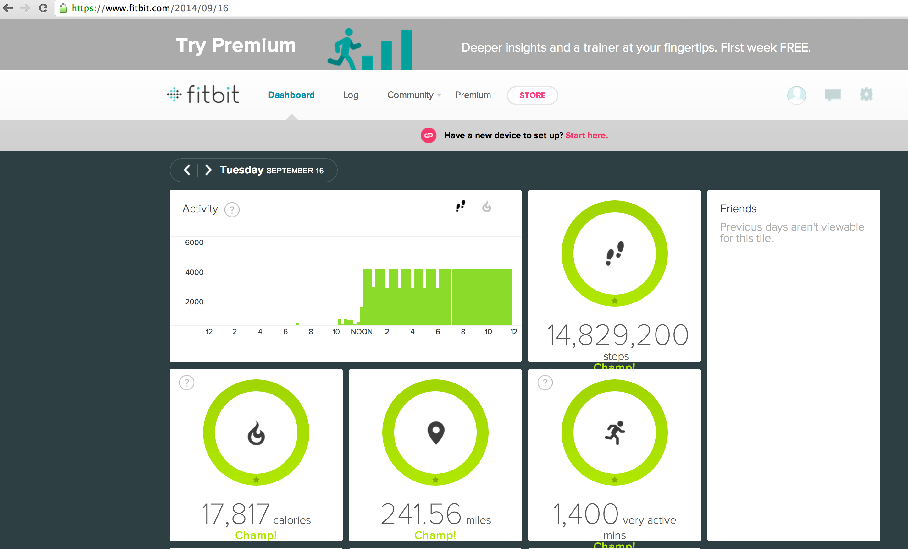

fitbit-hack
===========

Use this to quickly rack up steps through the magic of programming (without going outside, ever, or involving any laws of physics)

how-to
======

1. Go to https://dev.fitbit.com/apps/new and register a new app
2. Update `RunFirst.java` with your newly obtained `Client Key` and `Client Secret`
3. Run `RunFirst.java`
4. Update `Main.java` with the tokens obtained from `RunFirst.java`
5. Modify `Main.java` with desired date, hour, minutes, and workout details as you see fit ... pun intended 

proof
=====

